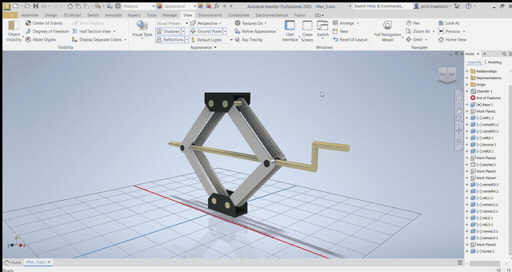
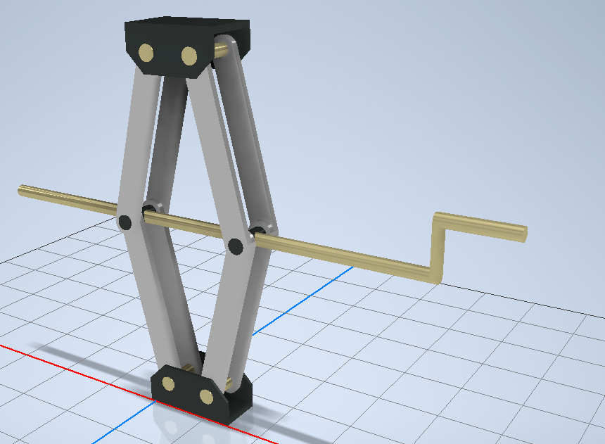
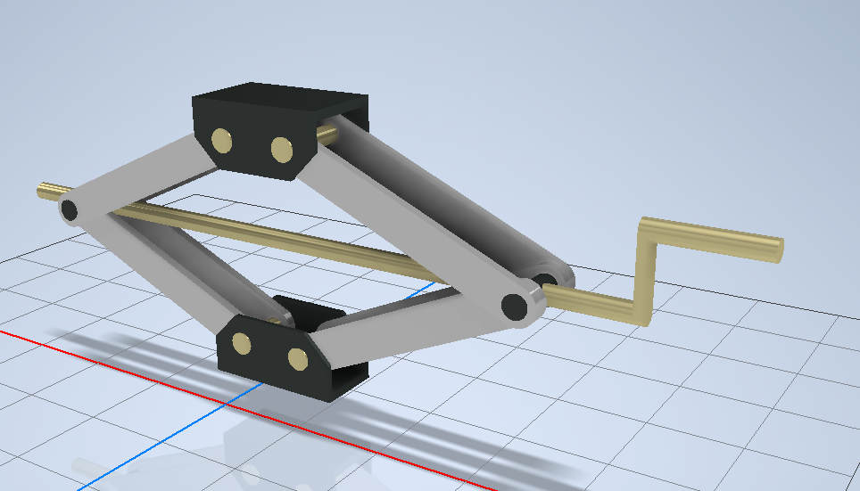

# Scissor Lift Mechanism — Autodesk Inventor CAD

**Personal CAD project · Piotr Trusiewicz · February 2025**

I designed this scissor-lift mechanism in Autodesk Inventor Professional 2025. I used my general understanding of how this type of lift works, rather than recreating a particular existing CAD model. The aim was to make a multi-part assembly whose linked arms could move between lower and higher positions.

[Small MP4 version](media/scissor-lift-motion-web.mp4) · [Original full-resolution recording](media/scissor-lift-motion.mp4)

## Design

The model has a base, an upper bracket, articulated arms, pivot connections and a hand crank. As the arms change angle, the upper bracket changes height. I modelled the parts and assembled them in Inventor, then checked the movement in the CAD environment. The recording shows the assembly moving through different positions; it is a CAD demonstration, not a test of a physical lift.

| Raised position | Lower position |
| --- | --- |
|  |  |

## CAD files

The [Inventor assembly](cad/lifter_3.iam) and its referenced `.ipt` part files are in the [`cad` folder](cad/). I kept their original Polish filenames because the assembly uses those names. The folder contains only the current files referenced by `lifter_3.iam`; older `OldVersions` files and an earlier `lifter_2` assembly are not included.

To inspect the model, keep the files together in one folder and open `lifter_3.iam` in Autodesk Inventor. I have not independently checked the downloaded copy in a fresh Inventor installation, so file resolution may need attention.

## Scope

This repository documents a CAD assembly and its motion in Inventor. It does not provide fabrication drawings, material specifications, a load rating, structural analysis or evidence of a built prototype.
